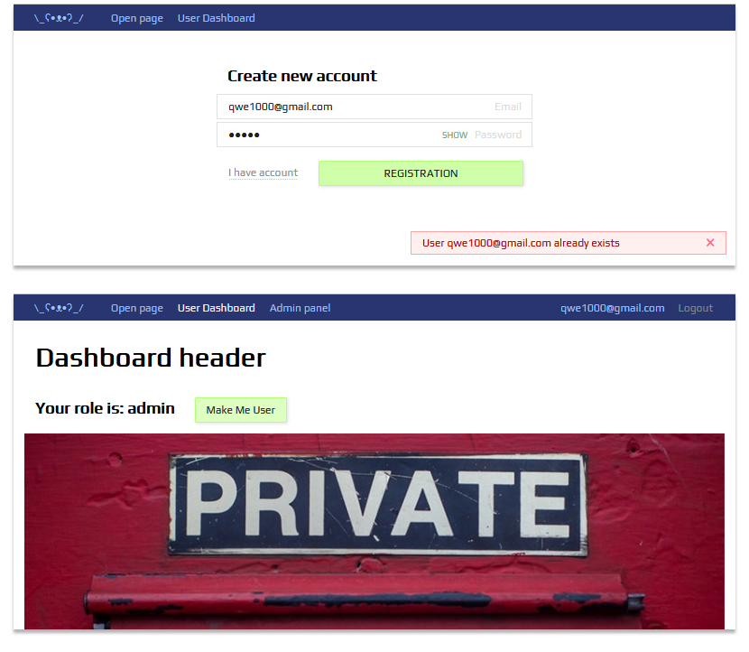

# Authorization server

## Includes: JWT Access & Refresh tokens, User Roles, Email activation, Alert Badges

### Demo page --> [Auth Simple on herokuapp.com](https://authsimple.herokuapp.com/)

## How to use

- Сlone or download archive to working folder
- Install npm packages specified in package.json file:

#### `cd server`

#### `npm install`

#### `cd client`

#### `npm install`

- Run to build:

#### `cd client`

#### `npm run prod`

#### `copy build folder from Client to Server/public`

- Run in the development mode:

#### `cd server`

#### `npm run dev`

In developer mode, an additional sass-compiler will be launched. It will track your `.sass` file save and make an
automatic compilation.

### Technical stacks and libraries used in the development

[React](https://www.npmjs.com/package/react), [Redux](https://www.npmjs.com/package/redux),
[Axios](https://www.npmjs.com/package/axios), [react-router-dom@6.0](https://www.npmjs.com/package/react-router-dom),
[Sass](https://www.npmjs.com/package/node-sass),
